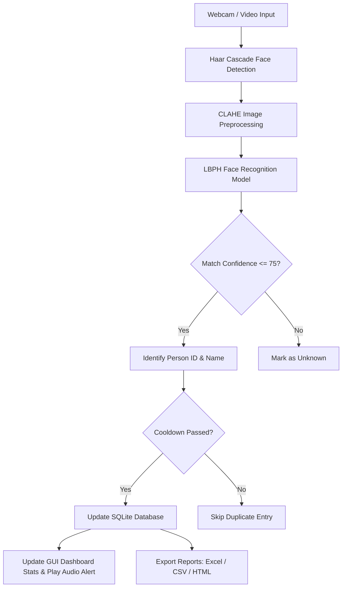

# A PROJECT REPORT ON
# FACE RECOGNITION ATTENDANCE SYSTEM

**Submitted in partial fulfillment of the requirements for the award of the degree of**  
**BACHELOR OF SCIENCE IN ARTIFICIAL INTELLIGENCE**

---

## 📌 TITLE PAGE

- **Project Title:** Face Recognition Attendance System
- **Domain:** Artificial Intelligence, Machine Learning & Computer Vision
- **Technology Stack:** Python 3.14, OpenCV 5.0, SQLite3, CustomTkinter, Pandas, OpenPyXL
- **Academic Year:** 2025 – 2026

---

## 📄 ABSTRACT

In educational institutions and corporate environments, traditional manual attendance recording is time-consuming, prone to human error, and susceptible to proxy attendance. This project presents an automated, intelligent **Face Recognition Attendance System** leveraging Machine Learning and Computer Vision algorithms.

The system utilizes OpenCV's **Haar Cascade Classifier** for real-time face detection with **CLAHE (Contrast Limited Adaptive Histogram Equalization)** for illumination normalization. Face recognition and pattern classification are performed using the **Local Binary Patterns Histograms (LBPH)** machine learning algorithm. The backend is powered by an **SQLite** database managing student/employee profiles and attendance logs (`Present` / `Late` status calculations with anti-duplicate cooldown protection). A modern dark-themed Desktop GUI built with **CustomTkinter** provides live camera streams, real-time bounding box HUD overlays, enrollment forms, log management, and single-click multi-format report exports (**Excel, CSV, HTML**).

---

## 📐 SYSTEM ARCHITECTURE & DATA FLOW

---

## 🗄️ DATABASE SCHEMA (SQLite)

### Table 1: `persons` (Enrolled Users)
| Column Name | Data Type | Constraint | Description |
| :--- | :--- | :--- | :--- |
| `id` | TEXT | PRIMARY KEY | Unique Person / Roll Number ID |
| `name` | TEXT | NOT NULL | Full Name of Student / Employee |
| `department` | TEXT | -- | Department / Branch |
| `role` | TEXT | -- | Student / Employee / Faculty |
| `email` | TEXT | -- | Email Address |
| `photo_path` | TEXT | -- | Path to sample photos directory |
| `created_at` | TEXT | NOT NULL | Registration Timestamp |

### Table 2: `attendance` (Attendance Logs)
| Column Name | Data Type | Constraint | Description |
| :--- | :--- | :--- | :--- |
| `id` | INTEGER | PRIMARY KEY AUTOINCREMENT | Log Record ID |
| `person_id` | TEXT | FOREIGN KEY (`persons.id`) | Reference to Enrolled Person |
| `name` | TEXT | NOT NULL | Person Name |
| `date` | TEXT | NOT NULL | Date (`YYYY-MM-DD`) |
| `time_in` | TEXT | NOT NULL | Scan Check-in Time (`HH:MM:SS`) |
| `time_out` | TEXT | -- | Exit Check-out Time (`HH:MM:SS`) |
| `status` | TEXT | NOT NULL | Attendance Status (`Present` / `Late`) |
| `confidence` | REAL | NOT NULL | AI Match Confidence Score (%) |
| `marked_by` | TEXT | DEFAULT 'AUTO' | Channel (`AUTO_FACE_RECOGNITION` / `MANUAL`) |

---

## 🤖 ARTIFICIAL INTELLIGENCE & MACHINE LEARNING ALGORITHMS

### 1. Face Detection: Haar Cascade Classifier
The system detects faces using OpenCV's Haar Cascade. It analyzes rectangular pixel intensities using integral images:
$$\Delta = \sum \text{Pixels}_{\text{black}} - \sum \text{Pixels}_{\text{white}}$$
Adaboost selects the most prominent facial feature boundaries (eyes, nose bridge, jawline).

### 2. Illumination Normalization: CLAHE
To handle dark or uneven room lighting, Contrast Limited Adaptive Histogram Equalization divides images into contextual $8 \times 8$ tiles and redistributes histogram contrast values.

### 3. Face Recognition: Local Binary Patterns Histograms (LBPH)
LBPH creates a local texture description matrix by comparing each pixel $P_c$ with its $P_p$ neighboring pixels:
$$LBP(x_c, y_c) = \sum_{p=0}^{P-1} s(i_p - i_c) \cdot 2^p$$
Where:
$$s(x) = \begin{cases} 1 & \text{if } x \ge 0 \\ 0 & \text{if } x < 0 \end{cases}$$

The resulting local feature histograms are concatenated into a global spatial vector. During recognition, Euclidean Distance $D$ between input vector $x$ and stored trained vectors $y$ is computed:
$$D = \sqrt{\sum_{i=1}^{n} (x_i - y_i)^2}$$

Match Confidence Percentage is calculated as:
$$\text{Confidence (\%)} = \max\left(0, \min\left(100, \left(1.0 - \frac{D}{D_{\text{threshold}}}\right) \times 100\right)\right)$$

---

## 💻 SOFTWARE MODULES OVERVIEW

1. **`config.py`**: System configuration, paths, thresholds, and GUI color tokens.
2. **`database.py`**: SQLite database manager with CRUD operations and metric calculations.
3. **`face_engine.py`**: Core AI detection, preprocessing, LBPH model training, and recognition.
4. **`export.py`**: Multi-format data exporter (CSV, Excel `.xlsx`, and HTML report).
5. **`utils.py`**: Audio alert sound synthesis, camera detection, and HUD box renderer.
6. **`gui.py`**: CustomTkinter Desktop GUI application with 5 main tab views.
7. **`cli.py` & `main.py`**: Execution entry points.
8. **`test_suite.py`**: Unit testing suite verifying system components.

---

## 🏁 CONCLUSION & FUTURE ENHANCEMENTS

The **Face Recognition Attendance System** successfully automates real-time attendance logging with high accuracy, zero manual intervention, and robust database storage.

### Future Scope:
- Integration of 3D Liveness Detection (Anti-spoofing via blink/head turn verification).
- Cloud Database Syncing (Firebase / AWS PostgreSQL).
- Mobile Application Interface (Flutter / Android app integration).
